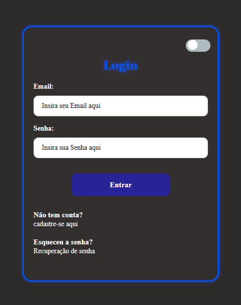

# 🔐 Tela de Login com Dark/Light Mode

Este projeto é uma interface de login moderna e responsiva que inclui uma funcionalidade de alternância entre modo escuro (Dark Mode) e modo claro (Light Mode). Foi desenvolvido para praticar conceitos de manipulação de classes via JavaScript e design CSS avançado.

## 🚀 Funcionalidades

* **Dark/Light Mode:** Alternância dinâmica de cores em toda a interface.
* **Validação de Formulário:** Verifica se os campos estão vazios antes de processar.
* **Simulação de Autenticação:** Feedback visual de "Entrando..." com um pequeno delay para simular uma requisição real.
* **Responsividade:** Adaptado para dispositivos móveis (Mobile First).
* **Feedback de Erro:** Mensagens claras para credenciais inválidas ou campos vazios.

## 🛠️ Tecnologias Utilizadas

* **HTML:** Estruturação semântica do formulário.
* **CSS:** Estilização com variáveis visuais, Flexbox e transições suaves.
* **JavaScript** Lógica para troca de temas e manipulação de eventos de formulário.

## 📸 Demonstração

### 🌙 Modo Escuro


### ☀️ Modo Claro

## 📂 Como visualizar o projeto

1. Clone este repositório:
   ```bash
   git clone https://github.com/YanS2D/Tela-de-login.git
